# Сравнительный анализ GC. Выбор наиболее подходящего для приложения. 

## Сценарий тестирования

Используемая версия jdk - Liberica OpenJDK Runtime Environment (build 13.0.2+9)

Список GC, используемых для анализа:

- G1
- Shenandoah
- ParallelGC

Для проведения тестов использовался следующий workload:

1. для достижения OOM используется периодически расширяющийся ArrayList;
2. для нагрузки GC сборками мусора в old generation используется периодически одновляемый LinkedHashMap с переопределенным  методом removeEldestEntry(Map.Entry<S, U> eldest) (симуляция кэша);
3. в качестве наивной реализации клиента используется периодический поиск по кэшу из п.2.

Каждый из пунков выполняется в отдельном потоке.

Для анализа логов GC использовался сервис https://gceasy.io

## Результаты тестирования

### G1

#### small heap

Duration: 2 min 15 sec 879 ms

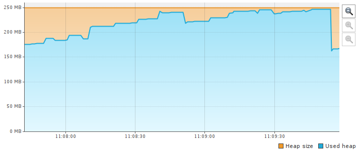

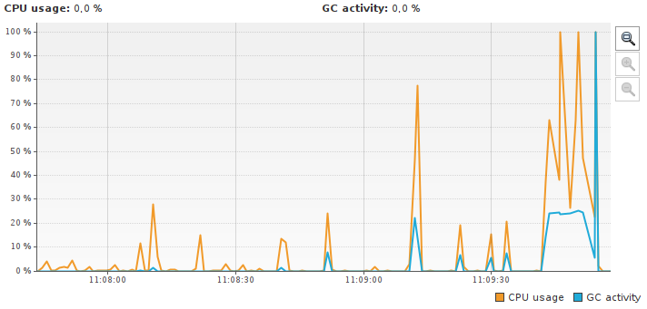

|                  | **Young GC**  | **Full GC**  | **Concurrent** | **Remark** | **Cleanup** |
| ---------------- | ------------- | ------------ | -------------- | ---------- | ----------- |
| **Total Time**   | 11 sec 785 ms | 8 sec 652 ms | 2 sec 392 ms   | 11.4 ms    | 1.19 ms     |
| **Avg Time**     | 89.3 ms       | 309 ms       | 478 ms         | 2.29 ms    | 0.239 ms    |
| **Std Dev Time** | 174 ms        | 10.0 ms      | 60.3 ms        | 1.09 ms    | 0.0534 ms   |
| **Min Time**     | 0.391 ms      | 294 ms       | 416 ms         | 1.23 ms    | 0.135 ms    |
| **Max Time**     | 1 sec 233 ms  | 330 ms       | 574 ms         | 3.80 ms    | 0.285 ms    |
| **Count**        | 132           | 28           | 5              | 5          | 5           |

##### Pause Time 

| **Total Time**   | 9 sec 553 ms |
| ---------------- | ------------ |
| **Avg Time**     | 67.8 ms      |
| **Std Dev Time** | 121 ms       |
| **Min Time**     | 0.135 ms     |
| **Max Time**     | 330 ms       |

##### Concurrent Time 

| **Total Time**   | 2 sec 392 ms |
| ---------------- | ------------ |
| **Avg Time**     | 478 ms       |
| **Std Dev Time** | 60.3 ms      |
| **Min Time**     | 416 ms       |
| **Max Time**     | 574 ms       |

##### Object Stats 

| Total created bytes  | 644 mb      |
| -------------------- | ----------- |
| Total promoted bytes | n/a         |
| Avg creation rate    | 4.74 mb/sec |
| Avg promotion rate   | n/a         |

#### large heap

Duration: 11 min 44 sec 121 ms (до наступления OOM у нескольких потоков)

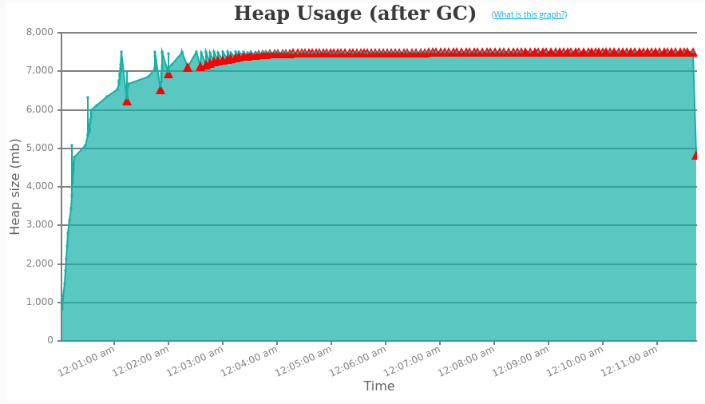


|                  | **Full GC**         | **Young GC**       | **Concurrent** | **Cleanup** | **Remark** |
| ---------------- | ------------------- | ------------------ | -------------- | ----------- | ---------- |
| **Total Time**   | 7 min 28 sec 535 ms | 6 min 34 sec 78 ms | 1 min 799 ms   | 8.11 ms     | 7.72 ms    |
| **Avg Time**     | 4 sec 531 ms        | 1 sec 767 ms       | 15 sec 200 ms  | 2.70 ms     | 1.93 ms    |
| **Std Dev Time** | 450 ms              | 3 sec 686 ms       | 3 sec 889 ms   | 0.678 ms    | 0.0668 ms  |
| **Min Time**     | 3 sec 899 ms        | 1.29 ms            | 10 sec 489 ms  | 1.75 ms     | 1.83 ms    |
| **Max Time**     | 6 sec 164 ms        | 21 sec 265 ms      | 21 sec 263 ms  | 3.24 ms     | 2.00 ms    |
| **Count**        | 99                  | 223                | 4              | 3           | 4          |


### Shenandoah

#### small heap

*OOM не достигнуто, поток с большими аллокациями притормаживается.

 Duration: 5 min 18 sec 932 ms

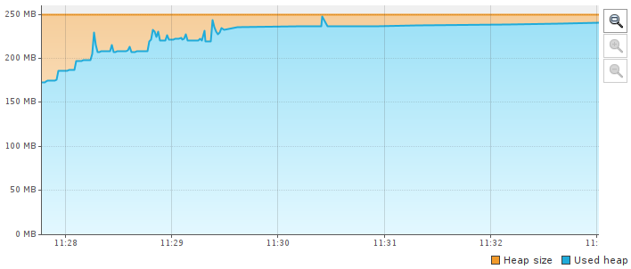

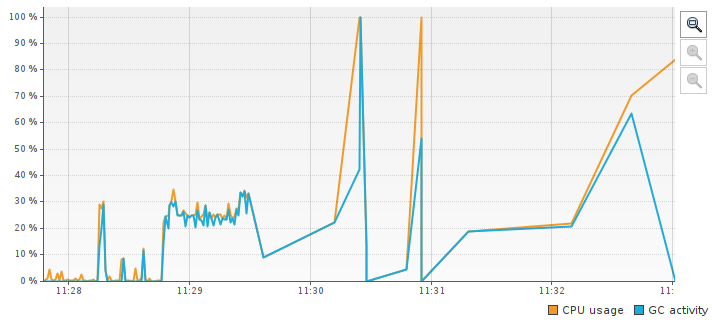


|                  | **Concurrent Marking** | **Concurrent Update** | **Concurrent Evacuation** | **Pause Final Mark** | **Pause Initial Mark** | **Concurrent Cleanup** | **Pause Final Update** | **Pause Init Update** |
| ---------------- | ---------------------- | --------------------- | ------------------------- | -------------------- | ---------------------- | ---------------------- | ---------------------- | --------------------- |
| **Total Time**   | 43 sec 69 ms           | 1 sec 817 ms          | 310 ms                    | 186 ms               | 119 ms                 | 5.50 ms                | 2.97 ms                | 0.507 ms              |
| **Avg Time**     | 171 ms                 | 101 ms                | 2.46 ms                   | 0.915 ms             | 0.474 ms               | 0.0271 ms              | 0.165 ms               | 0.0282 ms             |
| **Std Dev Time** | 77.2 ms                | 23.1 ms               | 3.53 ms                   | 0.577 ms             | 0.177 ms               | 0.0177 ms              | 0.0515 ms              | 0.0203 ms             |
| **Min Time**     | 1.03 ms                | 37.7 ms               | 0.0140 ms                 | 0.0120 ms            | 0.225 ms               | 0.0130 ms              | 0.0980 ms              | 0.0100 ms             |
| **Max Time**     | 248 ms                 | 120 ms                | 14.0 ms                   | 4.16 ms              | 1.88 ms                | 0.111 ms               | 0.257 ms               | 0.102 ms              |
| **Count**        | 252                    | 18                    | 126                       | 203                  | 252                    | 203                    | 18                     | 18                    |

##### Pause Time 

| **Total Time**   | 3 min 31 sec 462 ms |
| ---------------- | ------------------- |
| **Avg Time**     | 253 ms              |
| **Std Dev Time** | 313 ms              |
| **Min Time**     | 0.0100 ms           |
| **Max Time**     | 779 ms              |

##### Concurrent Time 

| **Total Time**   | 45 sec 202 ms |
| ---------------- | ------------- |
| **Avg Time**     | 179 ms        |
| **Std Dev Time** | 81.0 ms       |
| **Min Time**     | 1.03 ms       |
| **Max Time**     | 303 ms        |

##### Object Stats 					

| Total created bytes  | 720 mb      |
| -------------------- | ----------- |
| Total promoted bytes | n/a         |
| Avg creation rate    | 2.26 mb/sec |
| Avg promotion rate   | n/a         |

#### large heap

*OOM не достигнуто, поток с большими аллокациями притормаживается.

Duration: 2 hrs 49 min 35 sec (до ручной остановки приложения)

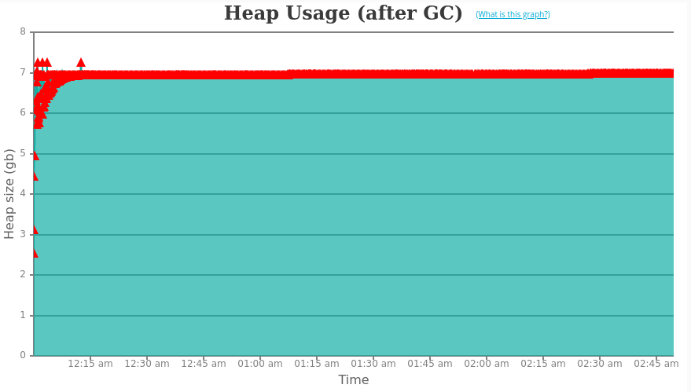

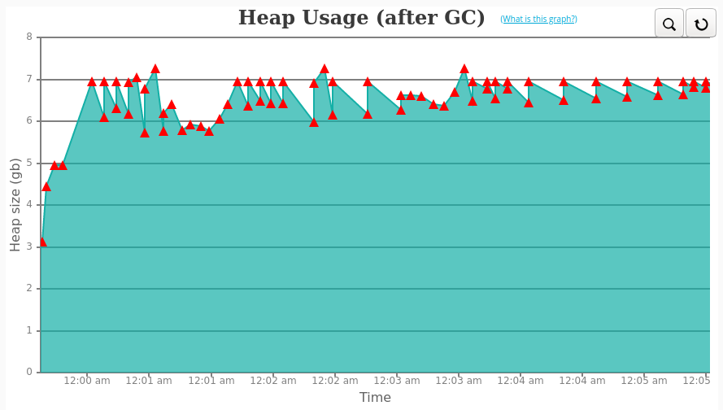


|                  | **Concurrent Marking** | **Concurrent Update** | **Concurrent Evacuation** | **Pause Initial Mark** | **Pause Final Mark** | **Concurrent Cleanup** | **Pause Final Update** | **Pause Init Update** |
| ---------------- | ---------------------- | --------------------- | ------------------------- | ---------------------- | -------------------- | ---------------------- | ---------------------- | --------------------- |
| **Total Time**   | 2 min 53 sec 539 ms    | 3 sec 274 ms          | 1 sec 788 ms              | 129 ms                 | 32.5 ms              | 2.64 ms                | 0.579 ms               | 0.120 ms              |
| **Avg Time**     | 807 ms                 | 1 sec 637 ms          | 85.1 ms                   | 0.599 ms               | 1.35 ms              | 0.110 ms               | 0.289 ms               | 0.0600 ms             |
| **Std Dev Time** | 1 sec 448 ms           | 439 ms                | 109 ms                    | 0.491 ms               | 0.217 ms             | 0.0520 ms              | 0.0335 ms              | 0.0140 ms             |
| **Min Time**     | 0.738 ms               | 1 sec 199 ms          | 0.109 ms                  | 0.273 ms               | 0.971 ms             | 0.0600 ms              | 0.256 ms               | 0.0460 ms             |
| **Max Time**     | 5 sec 214 ms           | 2 sec 76 ms           | 279 ms                    | 4.44 ms                | 2.00 ms              | 0.277 ms               | 0.323 ms               | 0.0740 ms             |
| **Count**        | 215                    | 2                     | 21                        | 215                    | 24                   | 24                     | 2                      | 2                     |

### ParallelGC

#### small heap

 Duration: 1 min 42 sec 713 ms 

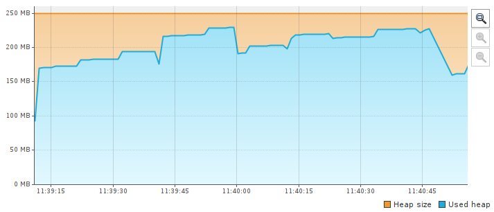

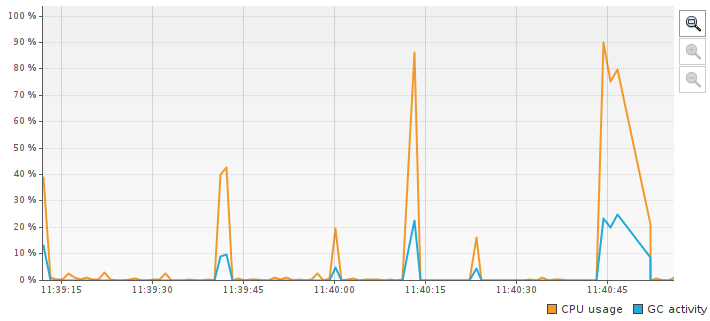

##### Total GC stats

| Total GC count        | 65               |
| --------------------- | ---------------- |
| Total reclaimed bytes | 623 mb           |
| Total GC time         | 12 sec 20 ms     |
| Avg GC time           | 185 ms           |
| GC avg time std dev   | 42.8 ms          |
| GC min/max time       | 33.7 ms / 436 ms |
| GC Interval avg time  | 1 sec 581 ms     |

##### Minor GC stats

| Minor GC count            | 3                 |
| ------------------------- | ----------------- |
| Minor GC reclaimed        | 45 mb             |
| Minor GC total time       | 232 ms            |
| Minor GC avg time         | 77.3 ms           |
| Minor GC avg time std dev | 30.8 ms           |
| Minor GC min/max time     | 33.7 ms / 99.2 ms |
| Minor GC Interval avg     | 299 ms            |

##### Full GC stats

| Full GC Count            | 62              |
| ------------------------ | --------------- |
| Full GC reclaimed        | 578 mb          |
| Full GC total time       | 11 sec 788 ms   |
| Full GC avg time         | 190 ms          |
| Full GC avg time std dev | 35.8 ms         |
| Full GC min/max time     | 166 ms / 436 ms |
| Full GC Interval avg     | 1 sec 642 ms    |

##### GC Pause Statistics

| Pause Count            | 65               |
| ---------------------- | ---------------- |
| Pause total time       | 12 sec 20 ms     |
| Pause avg time         | 185 ms           |
| Pause avg time std dev | 0.0              |
| Pause min/max time     | 33.7 ms / 436 ms |

##### Object Stats 					

| Total created bytes  | 783 mb      |
| -------------------- | ----------- |
| Total promoted bytes | n/a         |
| Avg creation rate    | 7.62 mb/sec |
| Avg promotion rate   | n/a         |

#### large heap

Duration: 5 min 54 sec 452 ms

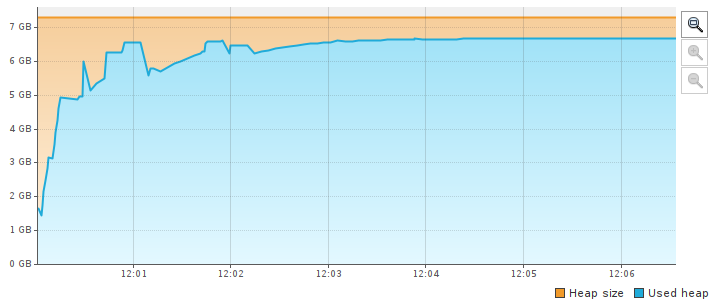

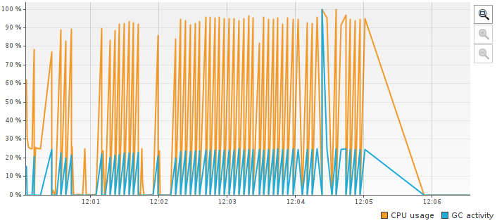

##### Total GC stats

| Total GC count        | 67                    |
| --------------------- | --------------------- |
| Total reclaimed bytes | 14.69 gb              |
| Total GC time         | 4 min 37 sec 605 ms   |
| Avg GC time           | 4 sec 143 ms          |
| GC avg time std dev   | 884 ms                |
| GC min/max time       | 914 ms / 8 sec 270 ms |
| GC Interval avg time  | 5 sec 278 ms          |

##### Minor GC stats

| Minor GC count            | 3                    |
| ------------------------- | -------------------- |
| Minor GC reclaimed        | 587 mb               |
| Minor GC total time       | 4 sec 829 ms         |
| Minor GC avg time         | 1 sec 610 ms         |
| Minor GC avg time std dev | 500 ms               |
| Minor GC min/max time     | 914 ms / 2 sec 64 ms |
| Minor GC Interval avg     | 6 sec 956 ms         |

##### Full GC stats

| Full GC Count            | 64                          |
| ------------------------ | --------------------------- |
| Full GC reclaimed        | 14.11 gb                    |
| Full GC total time       | 4 min 32 sec 775 ms         |
| Full GC avg time         | 4 sec 262 ms                |
| Full GC avg time std dev | 702 ms                      |
| Full GC min/max time     | 3 sec 425 ms / 8 sec 270 ms |
| Full GC Interval avg     | 5 sec 177 ms                |

##### GC Pause Statistics

| Pause Count            | 67                    |
| ---------------------- | --------------------- |
| Pause total time       | 4 min 37 sec 605 ms   |
| Pause avg time         | 4 sec 143 ms          |
| Pause avg time std dev | 0.0                   |
| Pause min/max time     | 914 ms / 8 sec 270 ms |


##### Object Stats 					

| Total created bytes  | 21.39 gb     |
| -------------------- | ------------ |
| Total promoted bytes | n/a          |
| Avg creation rate    | 61.81 mb/sec |
| Avg promotion rate   | n/a          |

## Статисика вызовов наивного клиента кэша

По логам потоков "cacheQueryThread", "cacheUpdateThread" и "largeAllocationThread" были получены следующие данные.

### cacheQuery

#### small heap

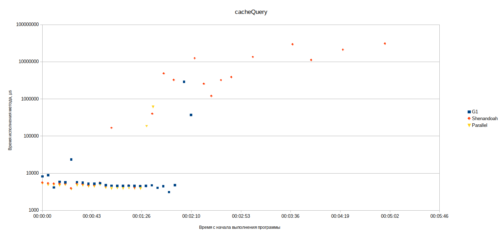

#### large heap


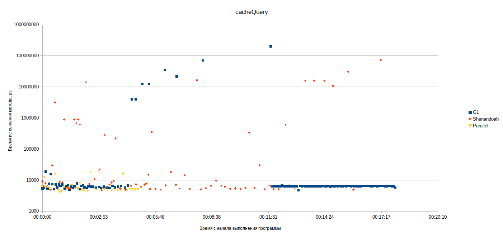

Примерно через 12 минут после старта приложения (при исползовании G1) наблюдается OOM , при этом поток "cacheQueryThread" продолжал логгировать результаты. При использовании ParallelGC - OOM через 5:54.

```
[681,064s][info][gc] GC(342) Pause Young (Concurrent Start) (G1 Evacuation Pause) 7495M->7495M(7500M) 4,714ms
[681,064s][info][gc] GC(344) Concurrent Cycle

Exception: java.lang.OutOfMemoryError thrown from the UncaughtExceptionHandler in thread "cacheUpdateThread"
[686,301s][info][gc] GC(343) Pause Full (G1 Evacuation Pause) 7495M->7495M(7500M) 5236,751ms
[690,519s][info][gc] GC(345) Pause Full (G1 Evacuation Pause) 7495M->7495M(7500M) 4204,531ms
[690,530s][info][gc] GC(344) Concurrent Cycle 9466,199ms
[690,532s][info][gc] GC(346) Pause Young (Normal) (G1 Evacuation Pause) 7495M->7495M(7500M) 1,771ms
[694,919s][info][gc] GC(347) Pause Full (G1 Evacuation Pause) 7495M->7495M(7500M) 4386,879ms
[700,043s][info][gc] GC(348) Pause Full (G1 Evacuation Pause) 7495M->7495M(7500M) 5114,574ms
[700,060s][info][gc] GC(349) Pause Young (Concurrent Start) (G1 Evacuation Pause) 7495M->7495M(7500M) 4,957ms
[700,060s][info][gc] GC(351) Concurrent Cycle

Exception: java.lang.OutOfMemoryError thrown from the UncaughtExceptionHandler in thread "largeAllocationThread"
[704,140s][info][gc] GC(350) Pause Full (G1 Evacuation Pause) 7495M->4826M(7500M) 4079,954ms
[704,149s][info][gc] GC(351) Concurrent Cycle 4088,614ms
```

### cacheUpdate

#### small heap

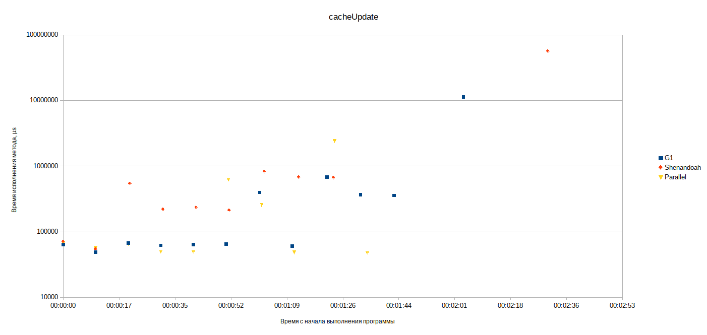

#### large heap

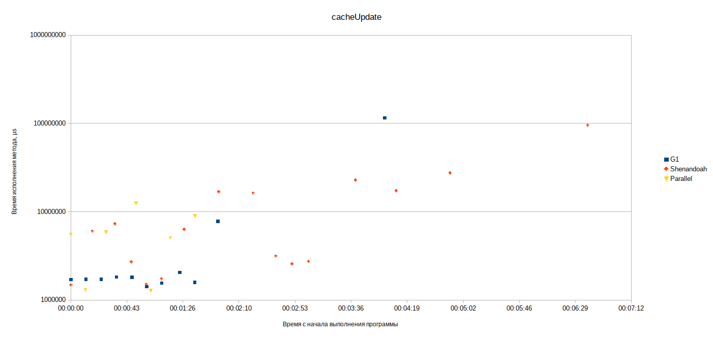

G1 показал более лучшие результаты в самом начале работы, Shenandoah обеспечил более "стабильное" выполнение работы (апдейт выполнялся чаще).

С определенного момента  работа по обновлению кэша замедлилась у всех рассматриваемых GC (ParallelGC - OOM через 5:54, G1 - OOM через 11:44).

### largeAllocation

#### small heap

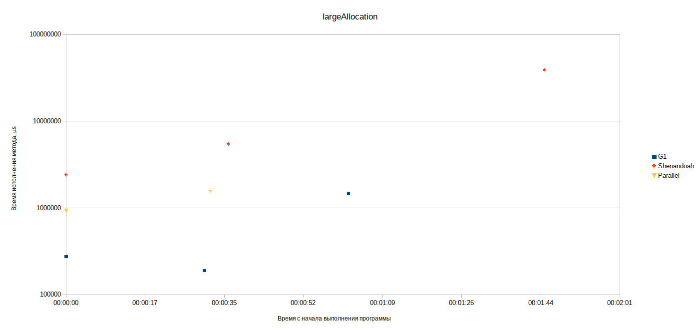

#### large heap

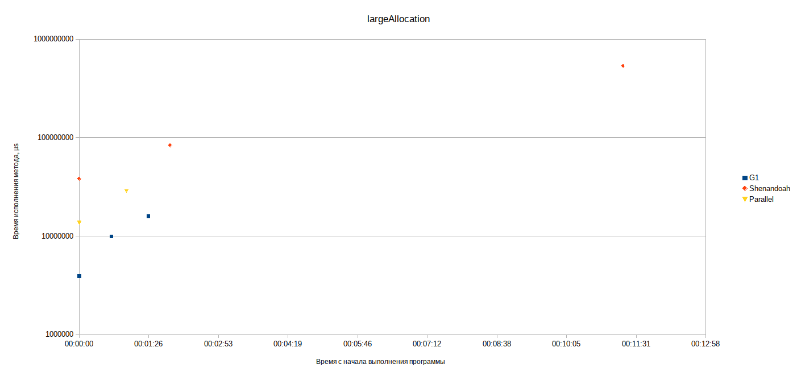

Представленная статистика кажется не очень репрезентативной, но полученные результаты у G1 лучше на старте приложения, Shenandoah смог аллоцировать в состоянии критической заполненности heap'а.

## Выводы

Можно отметить, что при использовании G1 в heap'е аллоцировалось до 7,494gb, при shenandoah - 6,980gb.

В целом, при использовании рассматриваемых GC, результаты по времени исполнения метода в потоке"cacheQueryThread" сопоставимы, однако часть замеров при использовании Shenandoah на старте приложения выбивается на несколько порядков в худшую сторону. В то же время, примерно через 5 минут после старта приложения показания при использовании Shenandoah приходят к наилучшим значениям (на несколько порядков лучше показателей, при использовании G1). 

Статистика работы потока "cacheUpdateThread" показала схожую картину - на старте приложения использование G1 привело к более лучшим результатам, а с ходом заполнения heap'а показания предпочтительнее при использовании Shenandoah.

STW паузы увеличивают время на доступ к кэшу.

Механизм сдерживания аллоцирующих потоков позволил Shenandoah обеспечить более долгую работу приложения в целом (приложение было остановлено вручную).

Такой механизм может спасти в ситуациях, когда heap близок к заполнению "живыми" данными(предупреждение события OOM). Это может быть полезно, если наблюдаются врЕменные всплески потребления памяти. Любой GC будет деградировать работу JVM, когда heap почти заполнен и 
большинство объектов достижимы, мои наблюдения показали, что в подобной ситуации Shenandoah продержался по времени дольше. 

В целом Shenandoah преодставляется более предпочтительным в связи с более "выживаемым" характером при критических значениях заполненности heap достижимыми данными.