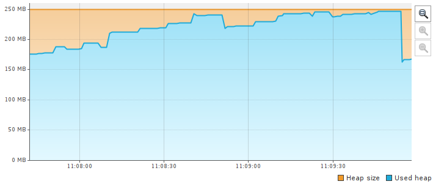
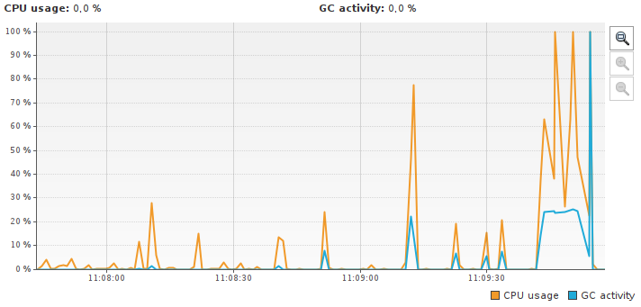
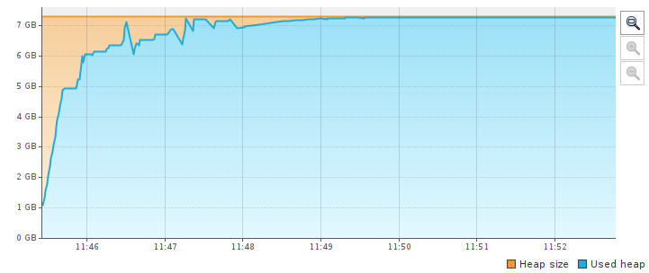
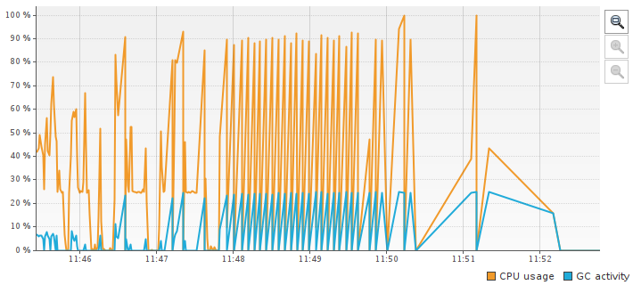
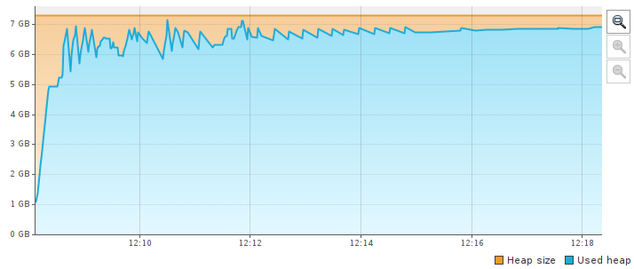
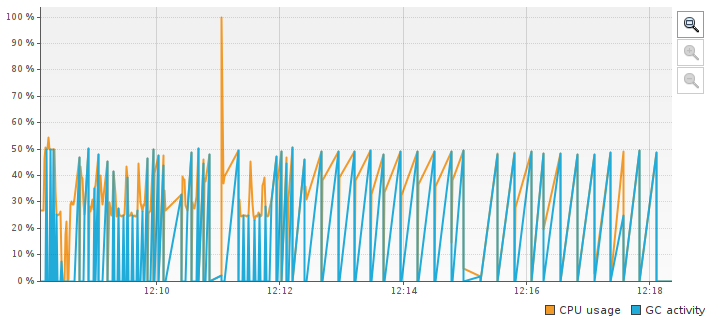
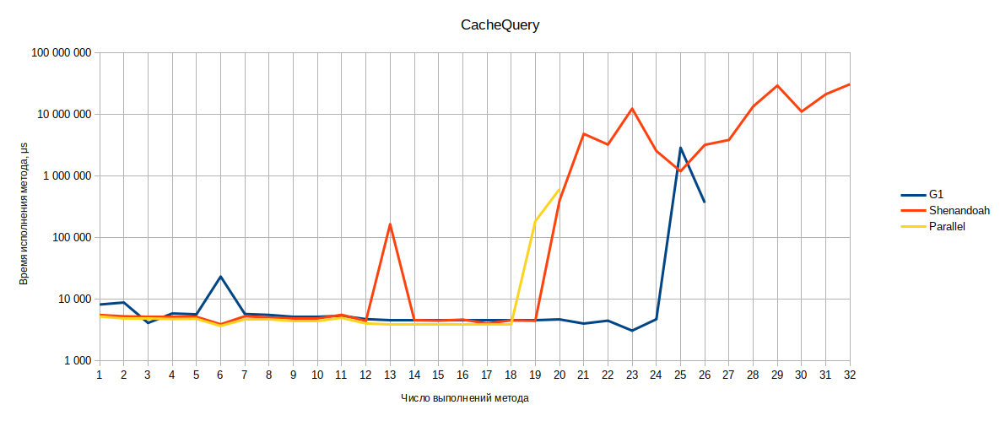
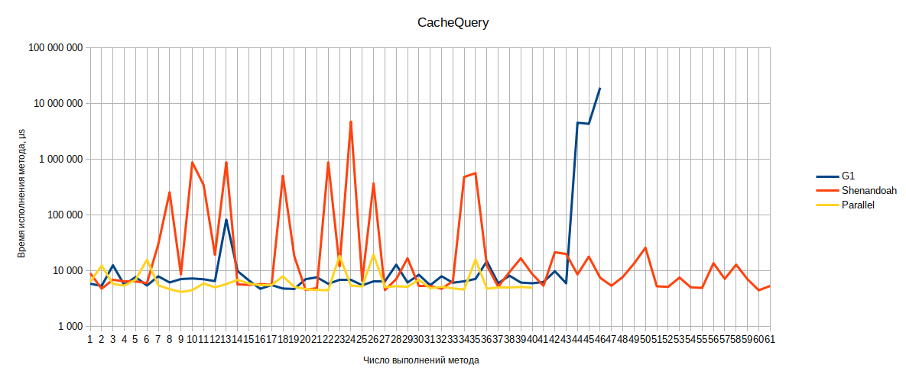

# Сравнительный анализ GC. Выбор наиболее подходящего для приложения. 

## Сценарий тестирования

Используемая версия jdk - Liberica OpenJDK Runtime Environment (build 13.0.2+9)

Список GC, используемых для анализа:

- G1
- Shenandoah
- ParallelGC

Для проведения тестов использовался следующий workload:

1. для достижения OOM используется периодически расширяющийся ArrayList;
2. для нагрузки GC сборками мусора в old generation используется периодически одновляемый LinkedHashMap с переопределенным  методом removeEldestEntry(Map.Entry<S, U> eldest) (симуляция кэша);
3. в качестве наивной реализации клиента используется периодический поиск по кэшу из п.2.

Каждый из пунков выполняется в отдельном потоке.

Для анализа логов GC использовался сервис https://gceasy.io

## Результаты тестирования

### G1

#### small heap

Duration: 2 min 15 sec 879 ms

|                  | **Young GC**  | **Full GC**  | **Concurrent** | **Remark** | **Cleanup** |
| ---------------- | ------------- | ------------ | -------------- | ---------- | ----------- |
| **Total Time**   | 11 sec 785 ms | 8 sec 652 ms | 2 sec 392 ms   | 11.4 ms    | 1.19 ms     |
| **Avg Time**     | 89.3 ms       | 309 ms       | 478 ms         | 2.29 ms    | 0.239 ms    |
| **Std Dev Time** | 174 ms        | 10.0 ms      | 60.3 ms        | 1.09 ms    | 0.0534 ms   |
| **Min Time**     | 0.391 ms      | 294 ms       | 416 ms         | 1.23 ms    | 0.135 ms    |
| **Max Time**     | 1 sec 233 ms  | 330 ms       | 574 ms         | 3.80 ms    | 0.285 ms    |
| **Count**        | 132           | 28           | 5              | 5          | 5           |

##### Pause Time 

| **Total Time**   | 9 sec 553 ms |
| ---------------- | ------------ |
| **Avg Time**     | 67.8 ms      |
| **Std Dev Time** | 121 ms       |
| **Min Time**     | 0.135 ms     |
| **Max Time**     | 330 ms       |

##### Concurrent Time 

| **Total Time**   | 2 sec 392 ms |
| ---------------- | ------------ |
| **Avg Time**     | 478 ms       |
| **Std Dev Time** | 60.3 ms      |
| **Min Time**     | 416 ms       |
| **Max Time**     | 574 ms       |

##### Object Stats 

| Total created bytes  | 644 mb      |
| -------------------- | ----------- |
| Total promoted bytes | n/a         |
| Avg creation rate    | 4.74 mb/sec |
| Avg promotion rate   | n/a         |

#### large heap

*OOM не достигнуто, поток с большими аллокациями притормаживается.

Duration: 6 min 48 sec 521 ms

|                  | **Young GC**        | **Full GC**         | **Concurrent** | **Cleanup** | **Remark** |
| ---------------- | ------------------- | ------------------- | -------------- | ----------- | ---------- |
| **Total Time**   | 3 min 51 sec 710 ms | 2 min 59 sec 635 ms | 39 sec 148 ms  | 9.03 ms     | 6.55 ms    |
| **Avg Time**     | 1 sec 457 ms        | 4 sec 727 ms        | 13 sec 49 ms   | 3.01 ms     | 2.18 ms    |
| **Std Dev Time** | 3 sec 180 ms        | 379 ms              | 1 sec 486 ms   | 0.974 ms    | 0.412 ms   |
| **Min Time**     | 2.06 ms             | 4 sec 175 ms        | 11 sec 11 ms   | 1.76 ms     | 1.61 ms    |
| **Max Time**     | 18 sec 610 ms       | 5 sec 729 ms        | 14 sec 509 ms  | 4.13 ms     | 2.54 ms    |
| **Count**        | 159                 | 38                  | 3              | 3           | 3          |

##### Pause Time 

| **Total Time**   | 3 min 10 sec 982 ms |
| ---------------- | ------------------- |
| **Avg Time**     | 1 sec 123 ms        |
| **Std Dev Time** | 1 sec 944 ms        |
| **Min Time**     | 1.61 ms             |
| **Max Time**     | 5 sec 729 ms        |

##### Concurrent Time 

| **Total Time**   | 39 sec 148 ms |
| ---------------- | ------------- |
| **Avg Time**     | 13 sec 49 ms  |
| **Std Dev Time** | 1 sec 486 ms  |
| **Min Time**     | 11 sec 11 ms  |
| **Max Time**     | 14 sec 509 ms |

##### Object Stats 					

| Total created bytes  | 14.67 gb     |
| -------------------- | ------------ |
| Total promoted bytes | n/a          |
| Avg creation rate    | 36.77 mb/sec |
| Avg promotion rate   | n/a          |

### Shenandoah

#### small heap

*OOM не достигнуто, поток с большими аллокациями притормаживается.

 Duration: 5 min 18 sec 932 ms

|                  | **Concurrent Marking** | **Concurrent Update** | **Concurrent Evacuation** | **Pause Final Mark** | **Pause Initial Mark** | **Concurrent Cleanup** | **Pause Final Update** | **Pause Init Update** |
| ---------------- | ---------------------- | --------------------- | ------------------------- | -------------------- | ---------------------- | ---------------------- | ---------------------- | --------------------- |
| **Total Time**   | 43 sec 69 ms           | 1 sec 817 ms          | 310 ms                    | 186 ms               | 119 ms                 | 5.50 ms                | 2.97 ms                | 0.507 ms              |
| **Avg Time**     | 171 ms                 | 101 ms                | 2.46 ms                   | 0.915 ms             | 0.474 ms               | 0.0271 ms              | 0.165 ms               | 0.0282 ms             |
| **Std Dev Time** | 77.2 ms                | 23.1 ms               | 3.53 ms                   | 0.577 ms             | 0.177 ms               | 0.0177 ms              | 0.0515 ms              | 0.0203 ms             |
| **Min Time**     | 1.03 ms                | 37.7 ms               | 0.0140 ms                 | 0.0120 ms            | 0.225 ms               | 0.0130 ms              | 0.0980 ms              | 0.0100 ms             |
| **Max Time**     | 248 ms                 | 120 ms                | 14.0 ms                   | 4.16 ms              | 1.88 ms                | 0.111 ms               | 0.257 ms               | 0.102 ms              |
| **Count**        | 252                    | 18                    | 126                       | 203                  | 252                    | 203                    | 18                     | 18                    |

##### Pause Time 

| **Total Time**   | 3 min 31 sec 462 ms |
| ---------------- | ------------------- |
| **Avg Time**     | 253 ms              |
| **Std Dev Time** | 313 ms              |
| **Min Time**     | 0.0100 ms           |
| **Max Time**     | 779 ms              |

##### Concurrent Time 

| **Total Time**   | 45 sec 202 ms |
| ---------------- | ------------- |
| **Avg Time**     | 179 ms        |
| **Std Dev Time** | 81.0 ms       |
| **Min Time**     | 1.03 ms       |
| **Max Time**     | 303 ms        |

##### Object Stats 					

| Total created bytes  | 720 mb      |
| -------------------- | ----------- |
| Total promoted bytes | n/a         |
| Avg creation rate    | 2.26 mb/sec |
| Avg promotion rate   | n/a         |

#### large heap

*OOM не достигнуто, поток с большими аллокациями притормаживается.

Duration: 10 min 8 sec 353 ms

|                  | **Concurrent Marking** | **Concurrent Update** | **Concurrent Evacuation** | **Pause Initial Mark** | **Pause Final Mark** | **Concurrent Cleanup** | **Pause Final Update** | **Pause Init Update** |
| ---------------- | ---------------------- | --------------------- | ------------------------- | ---------------------- | -------------------- | ---------------------- | ---------------------- | --------------------- |
| **Total Time**   | 2 min 34 sec 726 ms    | 2 sec 902 ms          | 1 sec 466 ms              | 46.6 ms                | 32.5 ms              | 2.29 ms                | 0.576 ms               | 0.127 ms              |
| **Avg Time**     | 2 sec 344 ms           | 1 sec 451 ms          | 66.6 ms                   | 0.707 ms               | 1.41 ms              | 0.0994 ms              | 0.288 ms               | 0.0635 ms             |
| **Std Dev Time** | 1 sec 693 ms           | 254 ms                | 98.0 ms                   | 0.361 ms               | 0.385 ms             | 0.0526 ms              | 0.0360 ms              | 0.0105 ms             |
| **Min Time**     | 1.16 ms                | 1 sec 197 ms          | 0.286 ms                  | 0.420 ms               | 0.882 ms             | 0.0500 ms              | 0.252 ms               | 0.0530 ms             |
| **Max Time**     | 5 sec 346 ms           | 1 sec 704 ms          | 277 ms                    | 2.96 ms                | 2.29 ms              | 0.287 ms               | 0.324 ms               | 0.0740 ms             |
| **Count**        | 66                     | 2                     | 22                        | 66                     | 23                   | 23                     | 2                      | 2                     |

##### Pause Time 

| **Total Time**   | 7 min 6 sec 491 ms |
| ---------------- | ------------------ |
| **Avg Time**     | 3 sec 159 ms       |
| **Std Dev Time** | 5 sec 544 ms       |
| **Min Time**     | 0.0530 ms          |
| **Max Time**     | 16 sec 307 ms      |

##### Concurrent Time 

| **Total Time**   | 2 min 39 sec 96 ms |
| ---------------- | ------------------ |
| **Avg Time**     | 2 sec 411 ms       |
| **Std Dev Time** | 1 sec 728 ms       |
| **Min Time**     | 1.16 ms            |
| **Max Time**     | 5 sec 505 ms       |

##### Object Stats 					

| Total created bytes  | 6.89 gb      |
| -------------------- | ------------ |
| Total promoted bytes | n/a          |
| Avg creation rate    | 11.59 mb/sec |
| Avg promotion rate   | n/a          |

### ParallelGC

#### small heap

 Duration: 1 min 42 sec 713 ms

##### Total GC stats

| Total GC count        | 65               |
| --------------------- | ---------------- |
| Total reclaimed bytes | 623 mb           |
| Total GC time         | 12 sec 20 ms     |
| Avg GC time           | 185 ms           |
| GC avg time std dev   | 42.8 ms          |
| GC min/max time       | 33.7 ms / 436 ms |
| GC Interval avg time  | 1 sec 581 ms     |

##### Minor GC stats

| Minor GC count            | 3                 |
| ------------------------- | ----------------- |
| Minor GC reclaimed        | 45 mb             |
| Minor GC total time       | 232 ms            |
| Minor GC avg time         | 77.3 ms           |
| Minor GC avg time std dev | 30.8 ms           |
| Minor GC min/max time     | 33.7 ms / 99.2 ms |
| Minor GC Interval avg     | 299 ms            |

##### Full GC stats

| Full GC Count            | 62              |
| ------------------------ | --------------- |
| Full GC reclaimed        | 578 mb          |
| Full GC total time       | 11 sec 788 ms   |
| Full GC avg time         | 190 ms          |
| Full GC avg time std dev | 35.8 ms         |
| Full GC min/max time     | 166 ms / 436 ms |
| Full GC Interval avg     | 1 sec 642 ms    |

##### GC Pause Statistics

| Pause Count            | 65               |
| ---------------------- | ---------------- |
| Pause total time       | 12 sec 20 ms     |
| Pause avg time         | 185 ms           |
| Pause avg time std dev | 0.0              |
| Pause min/max time     | 33.7 ms / 436 ms |

##### Object Stats 					

| Total created bytes  | 783 mb      |
| -------------------- | ----------- |
| Total promoted bytes | n/a         |
| Avg creation rate    | 7.62 mb/sec |
| Avg promotion rate   | n/a         |

#### large heap

Duration: 5 min 54 sec 452 ms

##### Total GC stats

| Total GC count        | 67                    |
| --------------------- | --------------------- |
| Total reclaimed bytes | 14.69 gb              |
| Total GC time         | 4 min 37 sec 605 ms   |
| Avg GC time           | 4 sec 143 ms          |
| GC avg time std dev   | 884 ms                |
| GC min/max time       | 914 ms / 8 sec 270 ms |
| GC Interval avg time  | 5 sec 278 ms          |

##### Minor GC stats

| Minor GC count            | 3                    |
| ------------------------- | -------------------- |
| Minor GC reclaimed        | 587 mb               |
| Minor GC total time       | 4 sec 829 ms         |
| Minor GC avg time         | 1 sec 610 ms         |
| Minor GC avg time std dev | 500 ms               |
| Minor GC min/max time     | 914 ms / 2 sec 64 ms |
| Minor GC Interval avg     | 6 sec 956 ms         |

##### Full GC stats

| Full GC Count            | 64                          |
| ------------------------ | --------------------------- |
| Full GC reclaimed        | 14.11 gb                    |
| Full GC total time       | 4 min 32 sec 775 ms         |
| Full GC avg time         | 4 sec 262 ms                |
| Full GC avg time std dev | 702 ms                      |
| Full GC min/max time     | 3 sec 425 ms / 8 sec 270 ms |
| Full GC Interval avg     | 5 sec 177 ms                |

##### GC Pause Statistics

| Pause Count            | 67                    |
| ---------------------- | --------------------- |
| Pause total time       | 4 min 37 sec 605 ms   |
| Pause avg time         | 4 sec 143 ms          |
| Pause avg time std dev | 0.0                   |
| Pause min/max time     | 914 ms / 8 sec 270 ms |

##### Object Stats 					

| Total created bytes  | 21.39 gb     |
| -------------------- | ------------ |
| Total promoted bytes | n/a          |
| Avg creation rate    | 61.81 mb/sec |
| Avg promotion rate   | n/a          |

## Статисика вызовов наивного клиента кэша

### small heap

### large heap

## Выводы

Характер реализованной нагрузки вынуждает GC (G1, Shenandoah) притормаживать аллоцирующие потоки (Allocation Failure). 

STW паузы увеличивают время на доступ к кэшу.

В целом метрики наивного клиента доступа к кэшу сопоставимы  при использовании рассматриваемых GC.

Из-за характера нагрузки не проявляется параллелизм compact-фазы Shenandoah.

В целом Shenandoah преодставляется более предпочтительным в связи с более "выживаемым" характером при критических значениях заполненности heap достижимыми данными.